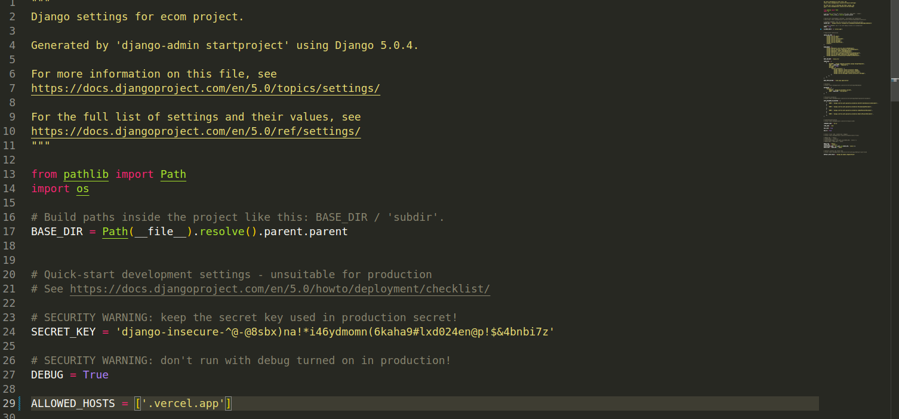
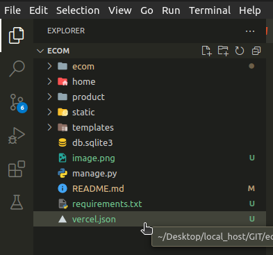
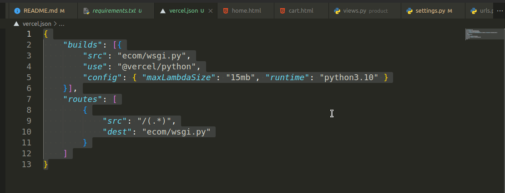
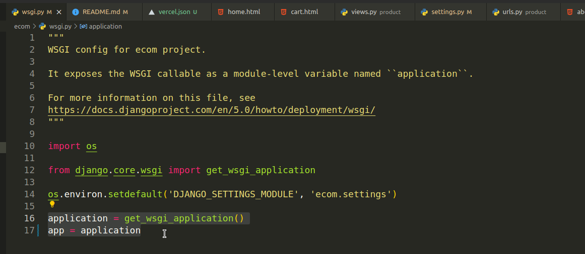

# Ecommerce website -Django

# Virtual Environment setup -
* Open terminal or command prompt
* Create virtualenv - `virtualenv venv`
* Activate vietualenv - `source venv/bin/activate`
* Install django - `pip install django`
* Start/Create Project - `django-admin startproject [project_name]`
* Go to the project directory - `cd [project_name]` or `cd ./[project_name]`

# Setup for vercel -
* Inside the `settings.py` file create host by using 
`ALLOWED_HOSTS = ['.vercel.app']`

* Create a `requirements.txt` file by using `pip freeze > requirements.txt`
* Create a `.json` file. Ex - `vercel.json`

* vercel.json -

* wsgi.py file - 

# Over View# django-ecommerce
# django-ecommerce
